<!-- ✨ HERO SECTION -->
<div align="center">


<div align="center">
  
  
  
  ### 👋 Hi, I'm Yuvraj Mishra
  
  **`Full-Stack Developer | AI Enthusiast | Aspiring Game Dev`**
  
  <p align="center">
    Passionate technologist building interfaces with purpose and products with polish.<br/>
    A design-first coder who loves solving real problems with beautiful code.<br/>
    <em>Crafting pixels & logic into experiences that matter.</em>
  </p>

  [](https://www.linkedin.com/in/the-yuvraj-mishra/)
  [](https://github.com/TheYuvrajMishra)
  [](https://www.buymeacoffee.com/YuvrajMishra)
  [](#)

  
  
</div>

---

<div align="center">
  
  ## 🎯 Quick Navigation
  
  [About](#-about-me) • [Tech Stack](#-tech-stack) • [Projects](#-featured-projects) • [Stats](#-github-stats) • [Contact](#-lets-connect)
  
</div>

---

## 🚀 About This Repository

> **Welcome to my digital portfolio!** This repository contains the source code for my personal portfolio website - a modern, responsive, and performant showcase of my work and skills.

```yaml
Status: Active Development
Version: 2.0.0
Last Updated: October 2025
License: MIT
```

### 🌟 Features

- ⚡ **Lightning Fast** - Optimized for performance
- 📱 **Fully Responsive** - Works on all devices
- 🎨 **Beautiful UI/UX** - Design-first approach
- ♿ **Accessible** - WCAG compliant
- 🌙 **Dark Mode** - Easy on the eyes
- 🔍 **SEO Optimized** - Better discoverability

---

## 👨‍💻 About Me

```typescript
const yuvraj = {
  location: "Kolkata, India 🇮🇳",
  role: "Full-Stack Developer",
  company: "ZyrixCraft",
  education: "Computer Science Student",
  currentFocus: ["TypeScript", "React", "Node.js", "DevOps"],
  interests: ["AI/ML", "Game Development", "Design Systems", "Open Source"],
  motto: "Design. Code. Repeat.",
  funFact: "I debug with console.log() and I'm not ashamed! 😄"
};
```

### 🎓 Journey

- 🏫 **Education**: Baidyapara High School
- 💼 **Current Role**: Web Developer & UI/UX Designer @ ZyrixCraft
- 🌱 **Learning**: Advanced TypeScript, System Design, Cloud Architecture
- 🎯 **Goal**: Build products that make a difference

> *"Turning coffee into code since... well, recently, but with passion!"* ☕

---

## 🛠️ Tech Stack

<div align="center">

### 💻 Frontend Development


### ⚙️ Backend Development


### 🔧 Tools & DevOps


### 🎨 Design Tools


</div>

---

## 📊 GitHub Stats

<div align="center">
  
  
  
  
  
  
  

</div>

---

## 🏆 Achievements

<div align="center">


</div>

---

## 💼 Experience

```mermaid
graph LR
    A[🎓 Student] --> B[💡 Self-Learning]
    B --> C[💻 ZyrixCraft]
    C --> D[🎨 Web Developer & UI/UX Designer]
    D --> E[🚀 Building the Future...]
    
    style A fill:#ff6b6b,stroke:#c92a2a,color:#fff
    style B fill:#4ecdc4,stroke:#0a9396,color:#fff
    style C fill:#45b7d1,stroke:#0077b6,color:#fff
    style D fill:#96ceb4,stroke:#52b788,color:#fff
    style E fill:#ffeaa7,stroke:#f4a261,color:#000
```



---

## 📚 Currently Learning

<div align="center">

| Technology | Progress | Priority |
|------------|----------|----------|
| Advanced TypeScript | ████████░░ 80% | 🔥 High |
| System Design | ██████░░░░ 60% | 🔥 High |
| Docker & K8s | ████░░░░░░ 40% | 🔸 Medium |
| AWS/Cloud | ███░░░░░░░ 30% | 🔸 Medium |
| Game Dev (Unity) | ██░░░░░░░░ 20% | 💚 Low |

</div>

---

## 🌐 Portfolio Website

<div align="center">

[](https://yuvrajmishra.vercel.app)

**Live at:** [yuvrajmishra.vercel.app](https://yuvrajmishra.vercel.app)

</div>

---

## 📞 Let's Connect!

<div align="center">

### 💬 I'm always open to interesting conversations and collaboration opportunities!

<p>
  <a href="mailto:your.email@example.com">
    
  </a>
  <a href="https://www.linkedin.com/in/the-yuvraj-mishra/">
    
  </a>
  <a href="https://twitter.com/YourTwitter">
    
  </a>
  <a href="https://discord.gg/YourDiscord">
    
  </a>
</p>

### ☕ Support My Work

If you like what I do, consider buying me a coffee!

[](https://www.buymeacoffee.com/YuvrajMishra)

</div>

---

---

## 📄 License

<div align="center">

This project is licensed under the **MIT License** - see the [LICENSE](LICENSE) file for details.

```
MIT License - Feel free to use this as inspiration for your own portfolio!
```

</div>

---

## 🙏 Acknowledgments

- Thanks to all the amazing open-source projects that made this possible
- Shoutout to the dev community for constant inspiration
- Special thanks to everyone who has supported my journey

---

<div align="center">

### 💖 Made with Love and Code


---

<p>
  
  
  
</p>

**Yuvraj Mishra** | Full-Stack Developer

</div>

---

<div align="center">
  
</div>
```

---
